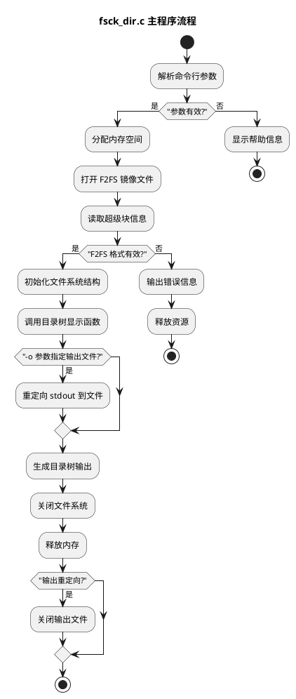
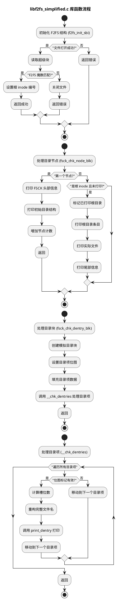

# fsck_dir 工具详解

## 概述

fsck_dir 是一个简化版的 F2FS 文件系统检查工具，专门用于显示 F2FS 镜像文件的目录树结构。它是从完整的 fsck.f2fs 工具中提取并简化而来的，专注于单一功能：显示目录结构。

## 主要特性

1. **轻量级**：只包含显示目录树所需的最小功能集
2. **独立性**：不依赖主 F2FS 工具集的任何库文件
3. **易用性**：简单的命令行接口，易于构建和使用
4. **兼容性**：与原版工具保持相同的用户接口

## 文件结构

```
fsck_dir/
├── fsck_dir.c              # 主程序源代码
├── libf2fs_simplified.c    # 简化的 F2FS 库函数实现
├── Makefile                # 构建配置文件
├── README.md               # 使用说明
├── README.final.md         # 中文使用说明
├── fsck_dir                # 编译后的可执行文件
├── complete_fsck_dir_directory_treev2.txt  # 示例输出文件
├── test_fsck_dir.sh        # 基本测试脚本
├── test_fsck_dir_functionality.sh  # 功能测试脚本
└── include/                # 头文件目录
    ├── simple_f2fs.h       # 简化的 F2FS 定义
    ├── simple_fsck.h       # 简化的 FSCK 定义
    └── fsck.h              # 部分 FSCK 定义
```

## 构建方法

```bash
cd fsck_dir
make
```

## 使用方法

### 基本用法

```bash
# 显示 F2FS 镜像的目录树
./fsck_dir -t /path/to/f2fs_image

# 显示版本信息
./fsck_dir -V

# 将输出重定向到文件
./fsck_dir -t /path/to/f2fs_image -o output.txt
```

### 参数说明

- `-t`：显示目录树（必须参数）
- `-V`：显示版本信息
- `-o <文件名>`：将输出重定向到指定文件

## 工作原理

### 主程序 (fsck_dir.c)

1. **参数解析**：解析命令行参数，识别 `-t`、`-V` 和 `-o` 选项
2. **文件重定向**：如果指定了 `-o` 参数，将标准输出重定向到指定文件
3. **F2FS 初始化**：调用 `f2fs_init_sbi()` 初始化 F2FS 文件系统结构
4. **目录树显示**：调用 `do_fsck_dir()` 函数显示目录树

### 简化库 (libf2fs_simplified.c)

1. **F2FS 结构初始化**：`f2fs_init_sbi()` 函数打开 F2FS 镜像文件并读取超级块
2. **目录树生成**：`fsck_chk_node_blk()` 函数生成目录树输出
3. **目录项处理**：`fsck_chk_dentry_blk()` 和 `__chk_dentries()` 函数处理目录项

## 输出格式

工具的输出格式与完整的 fsck.f2fs 工具相似，包含：

1. **文件系统信息**：版本信息、超级块信息等
2. **检查进度**：`[FSCK] Check node X / Y (Z%)` 格式的进度信息
3. **目录树结构**：使用树形结构显示目录和文件
4. **文件信息**：每个文件/目录的 inode 编号和加密状态
5. **检查结果**：文件系统检查的最终结果

示例输出：
```
[FSCK] Check node 1 / 2121 (0.05%)
|-- unencrypted <ino = 0x7>, <encrypted (0)>
|   |-- mode <ino = 0xe>, <encrypted (0)>
|   |-- key <ino = 0x8>, <encrypted (0)>
|   |   |-- version <ino = 0x9>, <encrypted (0)>
...
|-- Gerrit User Guides.pdf <ino = 0x6c>, <encrypted (0)>
|-- face.jpeg <ino = 0x114>, <encrypted (0)>
|-- subdir <ino = 0x119>, <encrypted (0)>
|   `-- nested.txt <ino = 0x1d4>, <encrypted (0)>
|-- test_file.txt <ino = 0x1d2>, <encrypted (0)>
|-- verification_file.txt <ino = 0x1d3>, <encrypted (0)>
[FSCK] Check node 2121 / 2121 (100.05%)
```

## 设计理念

### 简化原则

1. **功能简化**：只保留目录树显示功能，移除所有修复和验证功能
2. **依赖简化**：不依赖外部库，所有必要代码都包含在项目中
3. **结构简化**：简化数据结构和函数实现
4. **接口兼容**：保持与原版工具相同的命令行接口

### 独立性

1. **自包含**：所有必要文件都包含在 fsck_dir 目录中
2. **无外部依赖**：不需要主 F2FS 工具集的任何文件
3. **易于分发**：整个目录可以独立分发和使用

## 与原版工具的区别

| 特性 | 原版 fsck.f2fs | 简化版 fsck_dir |
|------|----------------|-----------------|
| 文件大小 | 大 | 小 |
| 依赖关系 | 复杂 | 无 |
| 功能范围 | 全面（检查、修复、验证） | 单一（仅显示目录树） |
| 构建难度 | 高 | 低 |
| 分发便利性 | 低 | 高 |
| 使用复杂度 | 高 | 低 |

## 应用场景

1. **快速查看**：快速查看 F2FS 镜像的目录结构
2. **调试分析**：分析 F2FS 文件系统的目录组织
3. **教学演示**：演示 F2FS 文件系统的目录结构
4. **轻量级工具**：在资源受限环境中使用

## 注意事项

1. **只读操作**：工具只进行只读操作，不会修改 F2FS 镜像
2. **简化实现**：为了简化，部分功能可能与原版工具有差异
3. **输出格式**：输出格式与完整工具相似但可能不完全相同
4. **错误处理**：简化了错误处理逻辑

## 代码流程图

### fsck_dir.c 流程图



### libf2fs_simplified.c 流程图



## 许可证

该工具遵循与原版 F2FS 工具相同的许可证（GPL v2）。